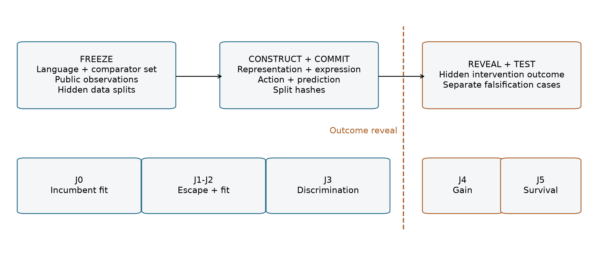
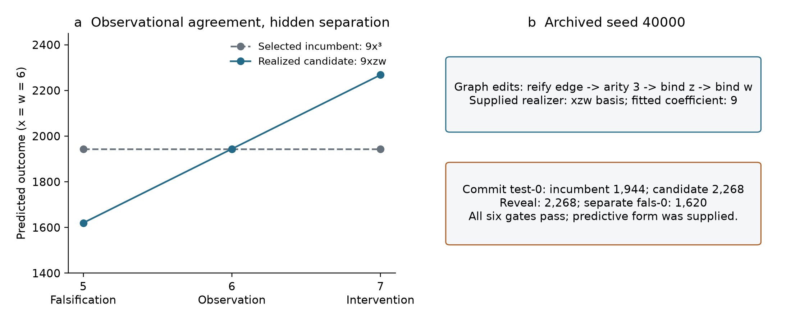
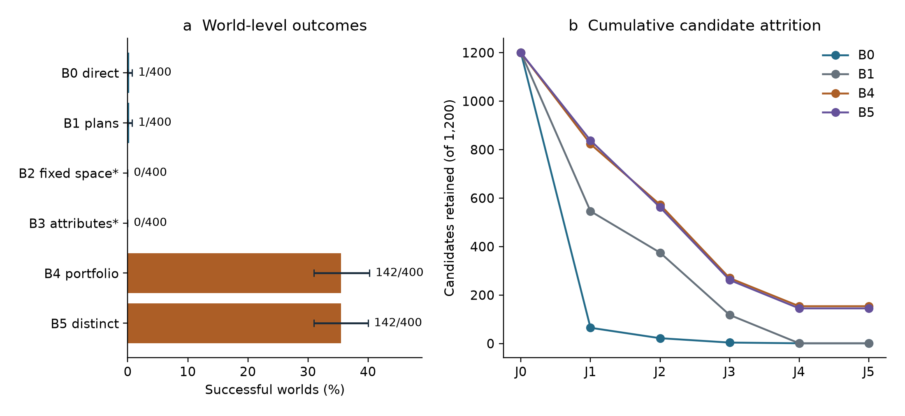
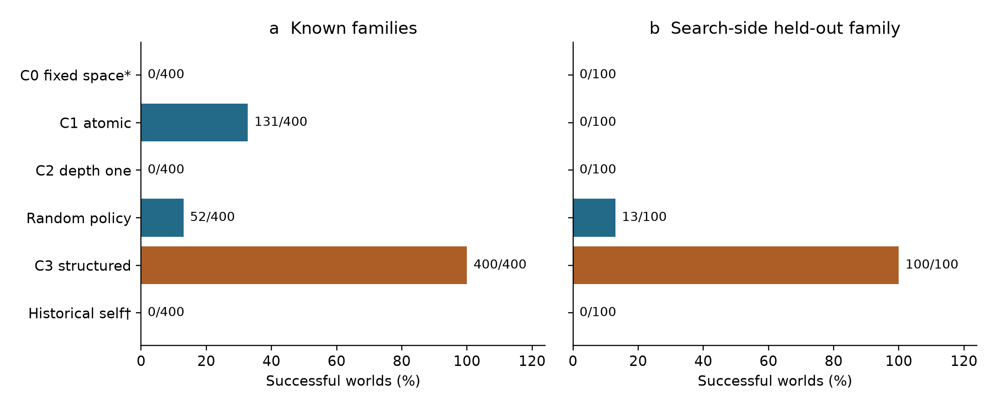
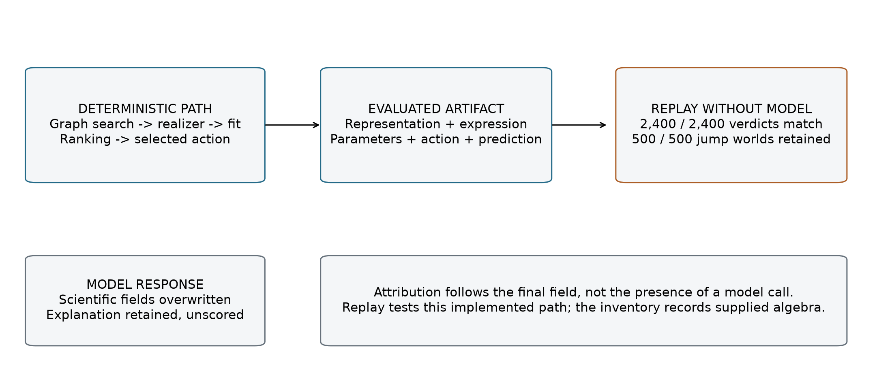
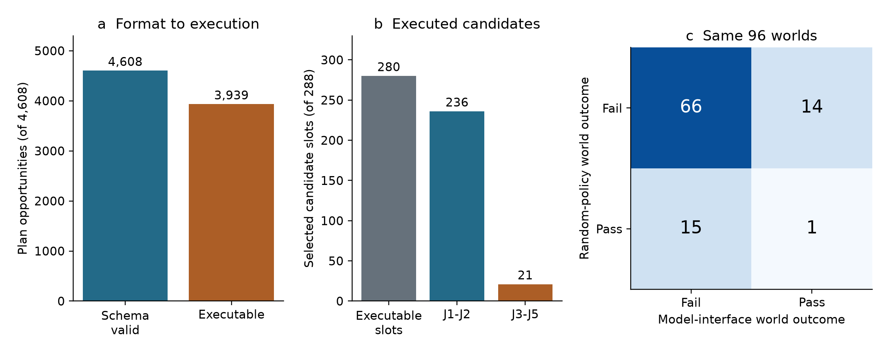
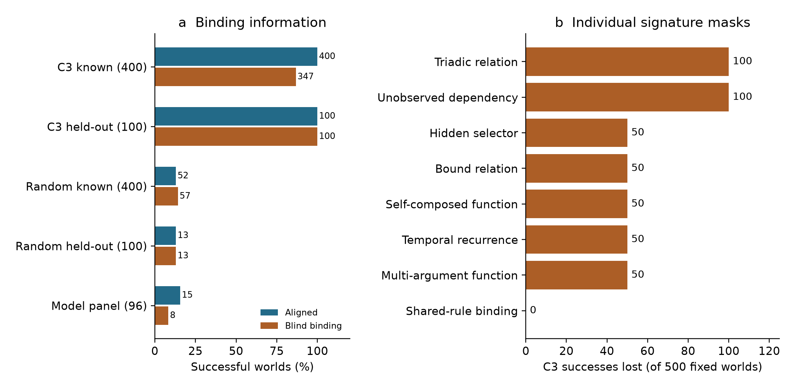

# Prospective evaluation and component attribution of hypothesis-space expansion in AI systems

Jing-Rung Huang¹,* and Wen-Hsiang Lu¹

¹ Department of Computer Science and Information Engineering, National Cheng Kung University, Tainan 701, Taiwan

* Correspondence: Jing-Rung Huang, p78084063@mail.ncku.edu.tw

ORCID: Jing-Rung Huang, 0000-0003-4776-3550; Wen-Hsiang Lu, 0009-0002-5149-6790

## Abstract

A hypothesis representation can limit what an AI system finds, even when search within that representation is effective. Modern discovery systems complicate evaluation because language-model proposals interact with programmed transformations, realizers, fitters and selection policies. We introduce a prospective executable assay for bounded hypothesis-space expansion and couple it to component-level provenance. A candidate must leave a frozen structural language, fit observations, commit to a discriminating intervention before outcome reveal, improve on a selected observation-optimal incumbent and survive held-out falsification. In 400 synthetic worlds, external typed proposals produced validated escapes in 142, compared with one each for direct-graph and mutation-plan model conditions. Structured composition succeeded in all 400 known-family worlds and 100 worlds from one search-side held-out family, under a hand-authored, family-aligned realization library that already contained the held-out basis. A post-hoc inference-free replay reproduced all 2,400 candidate verdicts: deterministic components supplied the evaluated theories, ranking and interventions. Conversely, historical self-composition failed before executable evaluation. A grammar-constrained interface exposed model-authored graph proposals, yielding successes in 15 of 96 worlds versus 16 for random composition on the same panel. The resulting evidence records distinguish validated system escape, model-authored content and dependence on supplied explanatory forms. This operationalizes a longstanding representation-search distinction while showing how prospective validation and artifact-level attribution can jointly identify what a hybrid system achieved and which components supplied it.

Keywords: knowledge representation; theory revision; heuristic search; abduction; hypothesis-space expansion; component attribution

## 1. Introduction

Searching a hypothesis language and changing that language are different operations. A learner can search effectively yet fail to reach a useful theory because its representation makes that theory unavailable, cumbersome or inaccessible to its revision operators. Constructive induction, predicate invention and theory restructuring have treated this problem for decades [7–9,32,40]. The distinction remains relevant when a language model proposes hypotheses: what appears to be a new explanation may originate in a model-generated representation, a program transformation, or a realization rule supplied by the system designer.

Recent discovery systems combine several such processes. Symbolic regression searches executable expressions; program-search systems combine learned proposals with deterministic evaluation; scientific agents retrieve literature, propose mechanisms, execute tests and revise hypotheses [10–20]. Some explicitly expand principle spaces, mechanistic model classes or causal structures [23–26]. Meanwhile, agent-evaluation research shows that parsers, tool interfaces and execution scaffolds can change scores in both directions [36–38]. A system-level outcome therefore leaves two questions unresolved: did the evaluated candidate change the declared representation, and who supplied the content responsible for its predictions?

These questions require more than a novelty judgment or an ablation of the model name. A new graph may be paired with an equation selected from a fixed basis library. A model may produce text that is replaced before evaluation. An apparently unsuccessful proposal may never reach an executable interface. Conversely, a model-authored expression can enter the evaluated artifact even when its representation was supplied externally. Each path supports a different claim about the system.

We study these distinctions through **bounded hypothesis-space expansion**. The term denotes a conjunction of structural and predictive requirements, not a measure of abduction or creativity as a whole. The incumbent structural language and finite executable comparator set are frozen. A candidate must be structurally outside that language, fit public observations and make a committed prediction that distinguishes it from the selected observational comparator. Hidden intervention outcomes and separate falsification cases then determine whether the candidate's predictive advantage survives. Structural non-membership is recorded independently of predictive performance.

The contribution has three parts. First, we specify a prospective executable evaluation target, with explicit separation between a representation language, a finite comparator set and the observation-optimal comparator selected from it. Second, we use frozen experiments to distinguish within-language controls, atomic representation proposals, local rewrites and complete compositional search policies. Third, we connect each verdict to a field-level provenance and replay procedure that records supplied knowledge, accepted model fields and overwrites. The procedure identifies both successful artifacts whose decisive content is deterministic and apparent failures caused by pre-execution attrition.

The experiments provide a deliberately exact setting for this analysis. Structured search saturates the studied generators under an aligned, hand-authored realizer. Removing model output preserves its verdicts. Repairing a different model-proposal interface yields executable graph edits but no aggregate advantage over random composition. These are informative results about the implemented paths, not a competition over general reasoning ability. Their methodological value is that the same end-to-end scoring rule can be joined to evidence explaining what was actually evaluated.

## 2. Background and related work

### 2.1. Abduction and theory revision

Peircean hypothesis formation and inference to the best explanation concern explanatory reasoning, but neither supplies a universal computational test of creativity [1–3]. A predictive theory may be useful without being structurally new, and a structurally novel proposal may explain nothing. Our assay operationalizes one bounded component of abductive reasoning: proposing an executable representational alternative and testing a discriminating consequence prospectively. The separation of observational agreement from interventional prediction follows the causal-inference distinction between those two sources of evidence [30,31].

Theory revision also includes several distinct operations. Belief update and revision can change accepted sentences within a fixed logical vocabulary; their semantic characterization is different from changing the vocabulary itself [42]. The ABC repair approach explicitly distinguishes adding axioms, deleting conflicting axioms and reforming a theory's language [41]. Timber assembles runnable qualitative models from fragments, organizes competing explanations and revises beliefs through metareasoning [33]. These precedents make representation and explanation construction central technical objects. Our contribution is an evaluation contract linking structural escape, prospective prediction and component provenance, rather than a new general account of theory change.

### 2.2. Constructive induction and representation change

Predicate invention introduces useful predicates beyond those initially supplied [7,8]. Constructive induction generates descriptors that change how examples and hypotheses are represented [40]. Donoho and Rendell distinguish limitations of a representation language from limitations of a theory's structure, showing why local revisions can be inadequate [9]. Meta-interpretive learning further provides executable predicate invention and recursive program induction under metarules [32]. These methods provide the foundations for representation-changing search examined here.

Boden's exploratory/transformational distinction and Wiggins's formal accounts of creative spaces provide a related conceptual vocabulary [4–6]. We use a narrower operational boundary. Whether a graph is admitted by a declared structural language is decidable in our implementation; whether its predictive function is inexpressible by every possible incumbent expression is a different question. Our membership certificate addresses the former.

Open-world AI gives this distinction a system-level setting. HYDRA repairs environment models through heuristic search [34], while a neurosymbolic architecture evaluates both components and integrated novelty accommodation [35]. Recent online causal-model learning uses dynamic predicate invention in a predict–verify–refine loop [39]. Their evaluation targets adaptation to changing environments; ours is the provenance of the particular executable artifact receiving a prospective escape verdict. Representation repair and component evaluation already coexist in these research programs.

### 2.3. Search-based AI discovery

Symbolic regression and physics-informed equation discovery search expressive program spaces with quantitative evaluators [10,11]. Algorithm discovery can similarly use reinforcement learning or language-model-generated programs [12,13]. In FunSearch, the language model proposes code and an evaluator guides selection [13]. This division of labor is explicit; it should not be collapsed into an undifferentiated claim of model reasoning.

The choice of language remains relative to the system being studied. A search procedure can leave a restricted incumbent language while remaining inside a larger designer-supplied meta-language. Our compositional experiments have exactly this character: graph rewrites trigger a fixed motif-to-basis realizer. They test how search organization accesses supplied predictive forms. Their success is compatible with a wholly deterministic path and with the decisive algebra having been specified in advance.

### 2.4. Language-model hypothesis generation and scientific agents

Hypothesis Search compiles hypotheses into executable programs, and other language-model approaches iteratively generate and update hypotheses for predictive tasks [14,15]. POPPER designs and executes sequential falsification tests with statistical error control [16]. Broader systems automate research workflows, integrate scientific tools, or validate selected proposals experimentally [17–20]. These contributions concern different combinations of proposal quality, execution, validation and workflow breadth.

Recent work is not uniformly restricted to a static hypothesis set. PiEvo evolves a principle space [23]. Model Discovery Agent couples model-proposed mechanistic structures to Bayesian fitting and experimental design, reports an expansion-component ablation and explicitly separates the proposer from numerical inference [24]. EvoSCM revises causal structures and mechanisms through discriminating interventions and committed predictions [26]. HypoArena evaluates open-ended hypotheses from reconstructed pre-conclusion contexts using reference separation and structured judging [25]. Its temporal construction is different from committing an executable candidate before revealing a simulator outcome.

HypoSpace and ResearchBench provide complementary diagnostics for underdetermination and task decomposition [27,28]. Creativity-task scores and historical discovery reconstructions likewise measure useful but distinct outcomes [21,29]. Zahavy's position motivates the question of generating explanatory premises [22]; our assay evaluates a bounded, executable instance of representational change.

### 2.5. Evaluation and attribution of hybrid systems

Harness-aware evaluation directly challenges treating agent scores as properties of model weights alone [36,37]. Standardized interfaces and environments expose failures caused by parsers or execution conventions, while complete-trace benchmarks study the responsible agent and decisive step of a failure [38]. We adopt this concern with observability but target a particular object: the explanatory content of a prospectively evaluated theory.

Harness-level evaluation asks how system configurations affect scores, whereas failure attribution identifies where an execution went wrong. Our target is the committed explanatory artifact: which components supplied its representation, predictive expression and intervention, and what a specified replay intervention changes in its prospective verdict. This distinguishes evaluation targets, without claiming that adjacent work excludes artifact provenance. The concrete record in Supplementary S20 links raw responses to the scored theory and its replay.

## 3. Formal framework

### 3.1. Incumbent language and executable comparator

A world supplies public observations D_obs, a finite set of public intervention actions U with their input settings, an incumbent representation R₀ and a frozen structural language A₀. Hidden information consists of intervention outcomes and a separate falsification split D_fal. Public actions expose possible inputs, not their outcomes. The procedural generator and evaluator can access hidden truth; proposers, fitters and ranking procedures cannot.

Let P₀ be the frozen finite set of incumbent executable programs. A₀ specifies admissible structures; P₀ specifies the actual executable comparators examined. They are not interchangeable. For a program h, L_obs(h) is mean squared error on D_obs. The selected observation-optimal comparator is

\[
h_0^* = \arg\min_{h\in\mathcal P_0}\bigl(L_{\mathrm{obs}}(h),\operatorname{canonical}(h)\bigr).
\]

The ordered pair is minimized lexicographically, with canonical program JSON breaking observation-loss ties. Intervention outcomes do not select the comparator. Exhaustiveness applies to P₀, not to every function expressible under A₀. Nor do we assume that all observation-optimal programs make identical interventional predictions. All reported gains refer to the selected h₀*.

### 3.2. Candidate theories and structural escape

A candidate theory is T=(R,f), where R is a typed structural representation and f is its executable predictive expression. Representations record nodes, edges, equations, dependencies, constraints, observability, temporal indices, arities and argument bindings. Canonical serialization sorts unordered fields. Membership checks inspect the frozen structural constraints and retain concrete reasons for rejection.

Structural escape requires a valid representation R∉A₀. Renaming or paraphrasing cannot by itself satisfy this test. The certificate concerns structural non-membership; it is not a proof of functional inexpressibility over the whole incumbent language. Because R and f are separate objects, provenance must record how a representation becomes a predictive expression. A motif realizer can supply f even when another component supplied R.

### 3.3. Prospective commitment and six gates

The assay requires the candidate, expression, selected action and prediction to be fixed before outcome reveal, with candidate and split hashes binding the commitment. In the historical CJ5 implementation, prediction precedes hidden-loss evaluation in the runner's control flow. The original commitment digest and timestamp were not persisted. The present audit therefore reconstructs commitment payloads and verifies scored content, rather than independently authenticating the historical reveal order. Supplementary S20 identifies recorded, reconstructed and unavailable fields. For the compositional paths, the action selector uses candidate and comparator predictions on public inputs:

\[
a^*\in\arg\max_{a\in\mathcal U}|f(a)-h_0^*(a)|.
\]

The deterministic implementation resolves ties reproducibly. This is outcome-blind prediction separation, not selection using the realized gain. Let L_int denote error on the committed intervention evaluation and L_fal error on the separate falsification cases. Define G_int=L_int(h₀*)−L_int(f) and G_fal=L_fal(h₀*)−L_fal(f). Let V(T) denote joint validity of the graph, executable expression and bounded feature-support checks. Supplementary S19 lists the exact checks and their limits; they do not establish graph/expression semantic equivalence. The implementation conjoins V(T) with each of J1-J5; the table shows the additional gate-specific requirements. The frozen gates are:

| Gate | Executable requirement | Role |
|---|---|---|
| J0 | L_obs(h₀*) ≤ 10⁻¹² | Incumbent already explains the public observations |
| J1 | R∉A₀, with V(T) | Structural escape with a membership-failure record |
| J2 | L_obs(f) ≤ 10⁻¹² | Candidate also explains the observations |
| J3 | Committed prediction separation ≥ 0.5 | Candidate and selected comparator discriminate before reveal |
| J4 | G_int > 0.1 | Candidate improves on the selected comparator after reveal |
| J5 | L_fal(f) ≤ 10⁻¹² and G_fal > 0.1 | Exact survival and gain on separate falsification cases |

Table 1. Six-gate evaluation contract. J3 uses committed predictions before outcome reveal; J4 and J5 use hidden outcomes.

Figure 1. Prospective evaluation boundary. Language, comparator rule and data splits are frozen before construction. The candidate and intervention prediction are committed before outcome reveal. Schematic prepared with ChatGPT/Codex assistance and rendered programmatically; no generative image model was used.

The bounded expansion event is J(T)=J0∧J1∧J2∧J3∧J4∧J5. A world succeeds if at least one of its three retained candidates passes J. The jump success rate is the proportion of jump worlds that succeed. Candidate counts describe attrition; worlds are the inferential units.

This conjunction makes several distinctions executable. Retrospective fit alone satisfies neither structural escape nor prospective discrimination. Structural escape alone supplies no predictive advantage. A fixed-language control cannot pass J1, regardless of its search quality. If the selected comparator is exact on every scored hidden control case, positive error reduction is impossible; a zero control rate then checks construction-specific consistency rather than estimating a general false-positive rate.

The gates are an operational contract for these noiseless worlds. The thresholds are not a statistical error-control theorem. No semantic creativity score, explanation quality, model confidence or embedding distance enters J.

### 3.4. Provenance and outcome dependence

The proposed evidence-recording contract stores each evaluated field's producer, parsed model value where applicable, transformations, final value and whether the evaluator reads it. At minimum, it covers representation, expression, fitted parameters, ranking and intervention. Overwrites remain explicit transformations. For historical data, fields that were not preserved are labeled unavailable; reconstructed values are recorded separately and do not replace missing original events.

The replay intervention specifies a replacement and what remains fixed. Given an archived artifact c, an evaluator E and a field intervention I, equality E(c)=E(I(c)) supports invariance under that intervention in the tested path. It does not imply that the component is irrelevant under every alternative design. Conversely, a changed verdict localizes dependence on the replaced content, but its interpretation depends on the replacement: substituting the comparator expression necessarily removes J3 separation and is a structural negative control.

The reusable audit combines five records: (1) the pre-reveal commitment, (2) field-level provenance, (3) executable replay results, (4) the intervention specification and (5) an inventory of supplied knowledge. The inventory includes operator semantics, basis libraries, fitting procedures, search/ranking rules and action-selection policy. Together they separate the claims in Table 2.

| Claim | Required evidence beyond a headline score |
|---|---|
| System-level validated escape | Frozen language and comparator rule; committed executable theory/action/prediction; all six gates |
| Model contributed the evaluated representation | Model-authored structural content survives parsing and transformations into the scored representation |
| Model content affects success | A specified field/component intervention changes the evaluated outcome, with fixed components and replacement semantics reported |
| Origin of the explanatory form | Identify whether the form was directly supplied as a template, constructed compositionally or generated by a learned proposer; document the supplied library and derivation |
| Autonomous theory revision | The claimed autonomous boundary covers proposal, realization and validation; external theory content and human interventions are explicitly accounted for |

Table 2. Evidence required for different AI discovery claims. Records of origin and construction do not by themselves establish scientific novelty. Field authorship and outcome dependence are distinct estimands.

Procedure box. Freeze the evaluated object and public/hidden contract; trace each scored field through parsing, realization, fitting and overwrites; label runtime records separately from code-inspected or reconstructed provenance; specify the replacement and fixed components; recompute the commitment and gates; report the changed fields, verdict and supplied forms. Schema `schemas/aij-evidence-record-v1.schema.json` and tools `scripts/build_aij_evidence_record.py` and `scripts/validate_aij_evidence_record.py` implement record version 1.0.0. Supplementary S20 illustrates the procedure with the archived candidate used in Section 5.1.

## 4. Experimental framework

### 4.1. Procedural worlds and freezes

AJ5 contains eight procedural families: latent common cause, unification, hidden regimes, property-to-relation, state invention, coordinate transformation, causal ambiguity and meta-law. Each has 50 jump worlds and 25 control worlds. CJ5 uses new seeds for the same family counts and adds 100 jump and 100 control worlds from triadic relation reification. The shared benchmark design is synthetic and noiseless. Its purpose is exact verification of public/hidden boundaries, structural membership and predictions.

World generation uses no model output. The generator supplies observations compatible with an incumbent program and cases on which an escaped candidate can discriminate. Controls retain an incumbent-compatible truth. Generator validation checks deterministic generation, hidden-truth redaction, observational adequacy and bounded constructive reachability.

The historical protocols were specified and frozen in Git before confirmatory model calls. These public commits are not independent registry timestamps; we describe the experiments as commit-frozen, not formally preregistered. Later interface and realizer analyses have their own freezes and are post-confirmatory sensitivities or audits. No main experiment was rerun for this manuscript. Supplementary Sections S1–S11 identify seeds, freezes and replay artifacts; S12–S17 distinguish completed sensitivities, operational amendments and excluded partial runs.

### 4.2. AJ5 search-space decomposition

B0 directly emits a typed graph. B1 requests independent mutation plans containing one to three typed operations, which the deterministic executor applies to the incumbent graph. B1 uses temperature 0.7 rather than B0's 0.2 and a different output contract; their comparison does not isolate sampling temperature. Both retain three candidate slots. B2 retains the incumbent representation while permitting within-space reasoning. B3 changes attributes or values within the incumbent language. B4 samples three proposals with replacement from a nine-member typed transformation portfolio. B5 selects three structurally distinct portfolio proposals with archive accounting and deterministic falsification. A separate value-only control also remains within the incumbent language.

B2/B3 and the value-only condition are structural controls, not fair contests over universal capability: their reachable representations cannot satisfy J1. B4/B5 are high-level proposals aligned to the procedural mechanisms. AJ5 asks whether representation-level inputs reach validated escape under this supplied proposal space.

A source-factorial comparison uses model-proposed, external-portfolio and supplied-correct representations in the same downstream path. The fitter and maximum-separation action selector supply values shown to the second model call and enforce them in the evaluated artifact. This comparison estimates the effect of the representation source on the complete pipeline, not the necessity of downstream model reasoning.

### 4.3. Generic rewrites, realization and search

CJ5 replaces atomic transformations with 29 local graph/syntax rewrites. Typing a newly added node, changing observability or arity, and binding arguments require separate edits. Operations do not receive family names, target distance or hidden outcomes. An ancestry record binds parent and child hashes, operation, canonical arguments, seed and depth.

C0 evaluates within-space candidates. C1 retains the high-level atomic reference. C2 evaluates depth-one generic alternatives. C_rand samples 48 four-step paths and retains candidates by seed-fixed structural hash. C3 traverses 48 four-step branches, with fixed allocations among generic topological patterns. It evaluates each intermediate graph through the realizer and fitter, then scores validity, escape, observational compatibility, public-action separation and diversity. Its final diversity-aware ranking retains three terminal candidates. Thus fitting precedes scoring and final selection, not only the final commitment.

C3 and C_rand share primitives and a realizer but differ in both traversal and final selection. Their contrast is between complete search-and-selection policies. C_self requests 16 four-step plans for each of three slots from the model; invalid plans consume their capacity. Conditional ceilings and unequal-semantics references are reported separately in the supplement.

The realizer matches graphs to nine hand-authored signatures and fits coefficients in their fixed basis libraries. It does not learn an unrestricted graph-to-law mapping. The supplied inventory is:

| Signature | Supplied basis/content | Aligned mechanism |
|---|---|---|
| Arity-three relation | x·z·w | Triadic held-out product |
| Temporally indexed recurrence | x and history sums | State invention |
| Unobserved dependency | Stable observed proxy | Latent common cause / causal ambiguity |
| Unobserved selector | Regime-signed x | Hidden regimes |
| Bound relation | Observed scalar variables | Property-to-relation |
| Self-composed function | x² | Coordinate transformation |
| Shared-rule binding | x and context | Unification |
| Multi-argument function | x and x·context | Meta-law |
| Incumbent fallback | First two scalar variables | Fallback incumbent form |

Table 3. Supplied realization inventory. Graph signatures select hand-authored basis content before observation-only coefficient fitting.

The triadic basis was present before held-out unlock. The held-out family therefore tests search-side structural transfer to one adjacent arity-three construction, not discovery of an unseen algebraic form. The language already contains reification and argument binding, and AJ5 includes a binary property-to-relation family.

### 4.4. Models and interface sensitivities

Historical experiments use frozen `microsoft/phi-4`, revision `2db69c1c3e91a05d2c64a3185acfbaf36f744e25`, served by vLLM 0.10.2 with dynamic bitsandbytes 4-bit quantization, a 4,096-token context and a 700-token completion cap. Temperature is 0.2 except AJ5 B1 mutation plans and factorial P0 at 0.7; top-p is 0.95. Requests use deterministic seeds; no fine-tuning or cross-world adaptation occurs. Allocations are reported separately from realized token use.

The targeted sensitivity panel selects 12 existing seeds per known family by outcome-blind SHA-256 ranking, giving 96 paired worlds. Legacy-interface conditions vary precision/serving, output budget, model or one validator-only repair. A separate 40-world positive control supplies the correct representation while evaluating the model-authored expression and action without overwrite. It differs from the historical source factorial.

The DeepSeek service identifies `deepseek-ai/DeepSeek-V4-Flash-Vision-Exp`, revision `86f746b36186f0e567729a5c06a8c918caba82a9`, on the patched vLLM runtime recorded in Supplementary S15. We do not substitute a different public model name. Native reasoning is returned separately from the final parser answer. The native and increased-budget conditions are not compute-matched to the historical cap.

The grammar-constrained sensitivity uses the same 96-world panel and 48 four-step opportunities per world. Each slot receives a native-reasoning call followed by a serialization call with exact operation keys and a constrained output schema, each capped at 4,096 tokens. This replaces the proposal-plus-explanation allocation, preserving six calls per world, but changes interface and token allocation together. Without a donor graph, 28 non-crossover primitives are available. Schema validity guarantees format, not dynamic executability or predictive adequacy.

Neither call receives truth, target distance, fitted expression, hidden outcome or gate feedback. The model supplies graph-edit topology. The unchanged deterministic scaffold supplies realization, fitting, ranking and the committed intervention. Full prompts, errors and operational exclusions are retained in the supplement and archive.

### 4.5. Component interventions and statistical analysis

The post-hoc C3 audit removes both model outputs, substitutes a valid empty explanation, reconstructs the deterministic artifact and recomputes commitments and gates without inference. It tests the implemented content path, not a retrained or redesigned system.

The separately frozen realizer audit fixes 3,288 archived candidate slots from C3/C_rand on 500 jump worlds and the grammar-constrained condition on 96 worlds. Eleven policies include aligned replay, incumbent-expression substitution, role/action-blind rebinding and eight individual non-incumbent signature masks. Blind rebinding preserves motif algebra but assigns type-compatible fields lexically, without node-role or intervention-change information, then refits and reselects the action outcome-blind. A signature mask falls back to the incumbent expression only for that signature. Graphs and slots stay fixed; adaptive re-search is outside the intervention.

World-level counts and rates are primary. AJ5 uses family-stratified paired bootstrap intervals from 10,000 replicates. Its archived uncentered bootstrap tail quantities are not null-calibrated P values and are not used for significance claims. CJ5 also reports paired sign-flip tests with correction within frozen comparison families in the supplement. Candidate rows describe attrition, never independent replication. Paired sensitivities use identical worlds and disclose joint outcomes. Family rates are descriptive: many seeds within co-designed generators do not establish breadth over independently authored domains.

## 5. Results

### 5.1. The assay separates fit, structural escape and prospective discrimination

The worked triadic world makes the distinction concrete. Public observations satisfy x=z=w and y=9x³. Both the selected incumbent y=9x³ and the candidate y=9xzw fit those observations exactly. Four generic edits reify the prediction edge, increase relation arity and bind z and w. The supplied realizer contributes the xzw basis and fits its coefficient.

Before outcome reveal, the system commits to changing z from 6 to 7 while x=w=6. The incumbent predicts 1,944 and the candidate 2,268; the revealed value is 2,268. A separate falsification case at z=5 yields 1,620, again matching the candidate. Structural membership fails on the recorded relation constraints, and all six gates pass. The example demonstrates validated escape under a supplied algebra, not algebraic invention.

Figure 2. Reconstructing the worked prospective example in Section 5.1. Archived held-out seed 40000 supplies the observations, committed test-0 and separate fals-0 outcome. The plotted slice fixes x=w=6. The complete falsification split also includes a second case, used in the all-gate verdict. The graph leaves the structural language; its product basis is supplied by the realizer. Figure prepared with AI-assisted code from the archived candidate and deterministic world reconstruction.

Controls show why the prospective gates matter. Among 900 C3 control candidates, 800 pass J1, 567 pass J2 and 283 pass J3, yet none passes J4. In AJ5, B4/B5 likewise retain 112/110 control candidates through J3, with none surviving J4. Thus fit plus structural departure plus predicted separation is insufficient.

An offline check verifies that the selected comparator exactly matches every scored control outcome: 1,125 intervention/falsification cases in 200 AJ5 controls and 1,625 in 300 CJ5 controls. Under this construction no candidate can achieve strictly positive error reduction. The zero control verdicts are therefore construction-specific checks of the assay, not a measured zero false-positive rate for noisy scientific discovery.

### 5.2. Representation-level proposals cross the declared boundary

| AJ5 condition | Reachable representation input | Selection / control role |
|---|---|---|
| B0 direct model | Model-emitted typed graphs | Direct proposal path |
| B1 mutation plans | Model-proposed typed operations applied to the incumbent graph | Independent plans; higher temperature and different output contract |
| B2 fixed-space reasoning | Incumbent graph only | Structural control: J1 unreachable |
| B3 attribute mutation | Within-language attributes | Structural control: J1 unreachable |
| B4 typed portfolio | Nine supplied transformations | Three draws with replacement |
| B5 distinct portfolio | Same supplied transformations | Three structurally distinct proposals; archive accounting |

Table 4. AJ5 reachable inputs and selection roles; Figure 3 reports counts and uncertainty.

Figure 3. Representation-level proposals under the prospective assay. (a) World success counts, n=400 per condition. Asterisks mark fixed-language structural controls whose reachable graphs cannot pass J1. (b) Cumulative gate retention among 1,200 candidates per condition; candidates are not independent replicates. Whiskers show 95% family-stratified bootstrap intervals. Figures 3, 4, 6 and 7 are reproducible plots of frozen artifacts, prepared with AI-assisted plotting code.

Both external proposal conditions achieve 35.5% world success. Their shared aggregate does not imply identical candidate trajectories. Among 1,200 jump-world candidates each, B4 retains 823 at J1, 573 at J2, 270 at J3 and 154 at J4–J5; B5 retains 838, 562, 262 and 145. Direct-graph proposals retain 65, 22, 4 and 1; mutation-plan proposals retain 546, 375, 118 and 1. These executed proposal paths fail at different stages, which a world-level rate alone conceals.

The representation-source factorial yields 0/400 for model-proposed representations, 142/400 for the external portfolio and 400/400 for supplied-correct representations. Its downstream fitted expression and intervention are enforced by the scaffold. The result shows sensitivity to representation input in that path; it does not identify a necessary contribution from the second model call.

### 5.3. Search organization matters under the fixed realizer

| CJ5 policy | Reachable construction | Selection / control role |
|---|---|---|
| C0 fixed space | Incumbent language | J1 structural control |
| C1 atomic reference | High-level supplied transformations | Atomic-proposal reference |
| C2 depth one | One generic edit | Local-rewrite control |
| C_rand | 48 four-step sampled paths | Seed-fixed structural-hash selection |
| C3 structured | 48 four-step structured branches | Intermediate fit/separation scoring; diversity-aware retention |
| Historical C_self | Requested model four-step plans | Best evaluated plan per slot; historical pre-execution attrition |

Table 5. Reachable constructions and selection policies under the fixed realizer; Figure 4 gives exact counts.

Figure 4. Generic search under a fixed realization language. Known-family and search-side held-out world counts have different denominators. C0 (*) is a structural control; historical self-composition (†) is interface-confounded. The C3/random contrast includes traversal and selection, not proposal source alone. The held-out algebraic basis was already supplied.

C3 saturates the known-family generators and the single search-side holdout. Its paired success-rate difference from C_rand is 0.87 in each population, with bootstrap 95% intervals [0.845, 0.895] and [0.80, 0.93], respectively. This estimates a complete-policy contrast: organized traversal and outcome-blind fitted ranking together access successful motif triggers more reliably than random paths with structural-hash selection.

The supplied inventory defines the scope of this holdout: the graph-search target was withheld during known-family confirmation, whereas the triadic realization basis was already available. The result establishes transfer of a bounded graph-search procedure to an adjacent structure under that realization language.

### 5.4. Field provenance and replay assign C3 success to the scaffold

In C3, representation construction, realization, fitting, ranking and action selection occur deterministically before the model response. Model-proposed representation, expression and intervention fields are overwritten. The remaining explanation is not read by J0–J5.

| Evaluated object | C3 source | Grammar-constrained source | Supplied-representation sensitivity source |
|---|---|---|---|
| Representation | Deterministic graph search | Executed model graph edits | Externally supplied correct graph |
| Executable expression | Motif realizer | Motif realizer | Model-authored expression |
| Parameters / fit | Deterministic observation fit | Deterministic observation fit | Values in the model-authored expression |
| Candidate ranking | Deterministic policy | Deterministic policy | Distinct supplied-representation control path |
| Committed action | Deterministic maximum separation | Deterministic maximum separation | Model-selected action |
| Explanation | Model text, unscored | Not a scored theory field | Model text, unscored |

Table 6. Final evaluated-field provenance differs across implemented paths.

Figure 5. C3 evaluated-field provenance and post-hoc replay. Scientific model fields are overwritten before scoring; the retained explanation does not enter the gates. Removing model outputs preserves all candidate verdicts and all jump-world successes, alongside zero control successes. Schematic prepared with ChatGPT/Codex assistance and rendered programmatically.

Removing the C3 model outputs reproduces all 2,400 candidate verdicts, retains all 500 jump-world successes and retains 0/300 control successes. This post-hoc intervention establishes that evaluated C3 success is independent of the removed model text in this implemented path. The successful artifact is authored by typed search, the supplied realizer, fitting and selection.

Provenance and replay answer complementary questions here. The provenance trace identifies the overwritten fields; replay checks that reconstructed commitments and evaluation preserve the archived outcomes.

### 5.5. Interface attrition separates non-execution from tested proposals

Historical C_self failures occur before executable plan evaluation. All 1,200 known-family proposal responses are non-empty and the legacy parser extracts a JSON object, but none has an outer `plans` list. All reach the 700-token cap, and none of 19,200 plan opportunities executes. Object extraction is therefore a misleading success indicator for this interface.

The legacy prompt omits exact executor argument keys. Targeted legacy-interface sensitivities remain at 0/96, including matched and native DeepSeek paths; native reasoning appears in a separate field without a usable final parser answer. These observations identify an execution boundary, not the absence of an internally useful conceptual proposal.

The two-stage grammar-constrained interface makes all 4,608 opportunities schema-valid and 3,939 dynamically executable. At least one executable plan survives in 280/288 slots; 236 selected candidates pass J1–J2 and 21 pass J3–J5, yielding 15/96 successful worlds (15.6%; Wilson 95% interval 9.7-24.2%). Successes occur in meta-law (9/12) and unification (6/12). The model thus supplies evaluated graph topology, while the realizer still supplies the predictive law.

Random composition succeeds in 16/96 worlds on the same panel. The paired outcomes are 66 joint failures, 15 random-only successes, 14 model-only successes and one joint success. The aggregate provides no model advantage over that comparator.

The separate supplied-representation DeepSeek control succeeds in 3/40 worlds. Its expression and selected action are genuinely model-authored and evaluated without overwrite, unlike the historical source factorial or C3. This is evidence of occasional executable use of a supplied representation, not a reliable ceiling or independent representation invention. The comparison illustrates why provenance must distinguish graph authorship from expression authorship.

Figure 6. Grammar-interface sensitivity. Plan opportunities (a), selected candidate slots (b) and paired worlds (c) are distinct units. Of 288 slots, 280 contain an executable selected plan; 236 pass J1-J2 and 21 pass J3-J5. The paired panel contains 96 worlds, with model and random successes in 15 and 16 respectively. Format repair exposes evaluated topology without an aggregate model advantage.

### 5.6. Binding and signature interventions localize dependence

Aligned realizer replay reproduces the frozen candidates and verdicts. Role/action-blind rebinding preserves 347/400 known-family and 100/100 held-out C3 successes. C_rand retains 57/400 and 13/100, and the grammar-constrained model retains 8/96. C3 losses are confined to hidden-regime and meta-law worlds. Because algebra and graphs remain fixed while variable binding changes, these outcomes localize sensitivity to binding information within the archived pipeline.

Individual signature masks reveal which supplied forms support those fixed candidates. Masking the triadic signature removes the 100 held-out C3 successes. Masking unobserved dependency removes 100 known-family successes across its two aligned mechanisms. Other signature effects and the redundancy of shared-rule binding are reported by family in Supplementary S17. A zero marginal loss can reflect another available realization route; it is not proof that a signature is universally unnecessary.

Replacing every candidate expression with the incumbent expression forces J3 failure by construction. We retain that intervention as a negative control, not the principal evidence of an irreplaceable realizer. All masks use fixed candidate slots rather than renewed adaptive search, so they measure dependence of archived artifacts on the specified realization policy.

Figure 7. Dependence on binding information and supplied signatures. (a) Aligned versus role/action-blind binding; annotations are successful-world counts and denominators appear in labels. (b) C3 world successes lost under each individual signature mask, combining 400 known and 100 held-out worlds. The triadic loss is confined to the holdout. All interventions fix archived candidate slots; no adaptive re-search occurs. Incumbent substitution is retained only as a structural negative control in the supplement.

### 5.7. Reproducibility of the evaluated artifacts

Historical replay reconstructs 10,800/10,800 AJ5 and 16,800/16,800 CJ5 selected candidates, including 35,533 CJ5 ancestry records, with no mismatches. The realizer audit contains 36,168 candidate-policy rows and 12,056 world-policy rows from the fixed slots and policies; it makes no model calls. These row counts establish reconstruction coverage, not independent experimental replication. No historical confirmatory world was excluded or confirmatory shard rerun. Separately disclosed interface pilots and partial extension runs do not contribute inferential denominators.

## 6. Discussion

### 6.1. Representation revision is relative to a declared language

The assay gives an executable interpretation to a longstanding distinction. Search can change values or select executable theories whose representations remain in A₀, or it can construct a valid R outside A₀. Predictive validation then tests whether the associated executable candidate outperforms the selected comparator on the committed hidden tests. This conjunction does not by itself identify the added graph structure as the cause of predictive gain.

The same candidate can escape an incumbent structural language and remain expressible in a supplied meta-language, as in CJ5. Composition within supplied primitives can construct forms that were not directly given; remaining within that language does not resolve a claim of invention. Reporting the library and derivation distinguishes such construction from access to a hand-authored basis. Structural controls check the incumbent boundary; alternative compositional policies test search under a shared realization inventory.

### 6.2. Provenance-aware evaluation concerns the scored artifact

The appropriate unit of attribution is the content that reaches the evaluator. In C3, deterministic overwrite separates model text from the artifact receiving the score. In grammar-constrained composition, model topology reaches the artifact but predictive algebra comes from the realizer. In the supplied-representation control, the graph is external while the expression and action are model-authored. An architecture diagram labeling each system “LLM-assisted” cannot distinguish these cases.

Historical self-composition supplies a fourth path: the model proposal never reaches executable evaluation. These paths distinguish pre-execution attrition, evaluated topology, evaluated expression authorship and deterministic theory construction. Only the supplied-representation control establishes evaluated model-authored expressions here; estimating their effect on success still requires a specified intervention. The C3 record in Supplementary S20 shows why deleting an unscored explanation can change a theory hash while preserving every gate.

### 6.3. Success and failure require symmetric care

End-to-end success can be credited to a model whose fields are discarded. End-to-end failure can obscure model content that never reaches an executable interface. Modern harness evaluation already identifies these risks [36–38]. Our setting adds an exact explanatory artifact and prospective gates through which their consequences can be traced.

The appropriate response to pre-execution failure is an attrition diagnosis, not an inference about all conceptual ability. Yet interface repair does not automatically validate the model either: after serialization succeeds, representations still face observational fit, discrimination and hidden tests. The repaired condition's 15/96 result is therefore informative even without an advantage over random composition. It locates what the model contributes and where the supplied scaffold remains responsible.

### 6.4. What the combined procedure adds

Each ingredient has precedent. Their combination makes a claim checkable against a specific artifact: membership records declared structural departure, hidden tests establish bounded predictive value, provenance identifies field origins and replay tests specified dependencies. The supplied inventory documents whether explanatory forms were provided directly or constructed from available primitives.

Another system can adopt the procedure box in Section 3.4 and the versioned schema in Supplementary S20 by replacing the local trace adapter and evaluator. It must preserve the distinctions between recorded facts, code-inspected transformations, offline reconstructions and unavailable events. The validator checks record structure, source hashes and reproduction of this example; it does not certify scientific novelty or manufacture missing timing evidence. In the historical CJ5 runner, commitment precedes hidden-loss evaluation in control flow, but the original commitment timestamp and digest were not retained in the candidate result. Recording those events at runtime would strengthen a future implementation.

## 7. Limitations

The environments are synthetic, noiseless and co-designed with the operators and realizer. Exact fitting and comparator checks enable deterministic audit but do not represent the uncertainty, measurement error or domain importance of real scientific discovery. C3 saturates these generators; that ceiling gives little information about difficulty outside the supplied mechanism inventory.

The structural language is finite-checkable and deliberately bounded. J1 is not a semantic expressivity theorem, and the selected finite-set comparator is not a universal incumbent oracle. Gains can depend on its canonical tie-breaking rule. The single held-out family is conceptually adjacent and its basis is pre-supplied. Seeds within these families quantify within-generator reliability, not generality over scientific domains.

Historical confirmation uses one model; the targeted extension adds one identified checkpoint on a fixed panel. Some sensitivities change serving engine, precision, interface or budget together. The grammar-constrained condition is a targeted interface sensitivity, not an isolated causal estimate for grammar alone or a frontier-model survey. The supplied-representation control is sparse and interface-limited.

Component deletion is post-hoc. The later realizer interventions are frozen before replay but act on archived graphs and fixed slots. They do not estimate how an adaptive search would compensate after losing a basis. Deterministic reconstruction strengthens internal traceability but is not independent replication. Public Git freezes also lack an independent registry timestamp.

The open questions concern independently authored domains, noisy evidence, less restricted languages and learned or unknown realization. The present evidence specifies how such systems could be evaluated; it does not demonstrate their performance or establish broad autonomous theory revision.

## 8. Conclusion

We introduce a prospective executable assay for bounded hypothesis-space expansion that distinguishes structural representational change from retrospective fit. Coupling this assay to field-level provenance, supplied-knowledge inventories and replay shows how end-to-end scores can misattribute both successful explanatory content and apparent model failure when deterministic scaffolds or interfaces mediate what reaches the evaluator. The resulting evidence contract separates what a hybrid system validates from what its model authors and what its designers have supplied.

## Data availability

Synthetic worlds, result tables, replay artifacts and manifests are available in the public repository https://github.com/gbanyan/abductive-jump. The frozen evidence archive is release `nmi-github-submission-v4` at https://github.com/gbanyan/abductive-jump/releases/tag/nmi-github-submission-v4; the historical release identifier is retained for exact traceability. The archive includes raw call ledgers and superseded-extension records not stored directly in Git, together with a file-level SHA-256 manifest and verification utility. Completed and partial runs remain distinguished. Original synthetic data and derived artifacts are licensed under CC BY 4.0 within the scope specified in `LICENSE_SCOPE.md`. No personal or restricted third-party research data were used. The evidence release is distinct from the present manuscript revision.

## Code availability

The same repository provides world generation, search, evaluation, fitting, offline attrition, statistics, plotting, component replay and archive verification. AIJ evidence-record schema and adapters (version 1.0.0), manuscript utilities and the present source package are fixed at tag `aij-review-package-v1`: https://github.com/gbanyan/abductive-jump/tree/aij-review-package-v1. Reproduction pairs this code tag with the unchanged data release `nmi-github-submission-v4`, rather than extracting older source files over the code checkout. Supplementary S20 and `docs/publication/AIJ_REPRODUCTION.md` give clean-environment commands. Original software is licensed under Apache-2.0 as scoped in `LICENSE_SCOPE.md`. Model weights are not redistributed; checkpoint identifiers, revisions and serving configurations are reported in the methods and supplement.

## Author contributions

Jing-Rung Huang: Conceptualization, Methodology, Software, Validation, Formal analysis, Investigation, Data curation, Visualization, Project administration, Writing – original draft. Wen-Hsiang Lu: Supervision, Writing – review and editing.

## Funding

This research received no specific grant from funding agencies in the public, commercial or not-for-profit sectors.

## Competing interests

The authors declare no competing interests.

## Declaration of generative AI and AI-assisted technologies in the manuscript preparation process

OpenAI ChatGPT and Codex assisted methodological discussion, literature synthesis and source checking, interpretation stress tests, manuscript organization and drafting, code inspection, audit implementation and reproducible figure preparation. Their use was substantive and was not limited to grammar correction. The human authors are responsible for reviewing and editing the assisted material, verifying references and numerical claims, and approving the final manuscript. Research uses, including the experimental Phi-4 and DeepSeek conditions and AI-assisted analysis-code development, are described in the methods and supplementary material. A stable deployed-build identifier was not available for the conversational assistance, so no finer version claim is made.

## References

1. C. S. Peirce, Deduction, induction, and hypothesis, Popular Science Monthly 13 (1878) 470–482.
2. G. H. Harman, The inference to the best explanation, Philosophical Review 74 (1965) 88–95.
3. P. Lipton, Inference to the Best Explanation, second ed., Routledge, 2004.
4. M. A. Boden, The Creative Mind: Myths and Mechanisms, second ed., Routledge, 2004.
5. G. A. Wiggins, A preliminary framework for description, analysis and comparison of creative systems, Knowledge-Based Systems 19 (2006) 449–458.
6. G. A. Wiggins, Searching for computational creativity, New Generation Computing 24 (2006) 209–222.
7. S. Muggleton, W. Buntine, Machine invention of first-order predicates by inverting resolution, Proceedings of the Fifth International Conference on Machine Learning (1988) 339–352.
8. I. Stahl, The Appropriateness of Predicate Invention as Bias Shift Operation in ILP, Machine Learning 20 (1995) 95–117. https://doi.org/10.1023/A:1022638219164
9. S. K. Donoho, L. A. Rendell, Rerepresenting and Restructuring Domain Theories: A Constructive Induction Approach, Journal of Artificial Intelligence Research 2 (1995) 411–446. https://arxiv.org/abs/cs/9504101
10. M. Schmidt, H. Lipson, Distilling free-form natural laws from experimental data, Science 324 (2009) 81–85.
11. S.-M. Udrescu, M. Tegmark, AI Feynman: A physics-inspired method for symbolic regression, Science Advances 6 (2020) eaay2631. https://doi.org/10.1126/sciadv.aay2631
12. A. Fawzi et al., Discovering faster matrix multiplication algorithms with reinforcement learning, Nature 610 (2022) 47–53.
13. B. Romera-Paredes et al., Mathematical discoveries from program search with large language models, Nature 625 (2024) 468–475. https://doi.org/10.1038/s41586-023-06924-6
14. R. Wang, E. Zelikman, G. Poesia, Y. Pu, N. Haber, N. D. Goodman, Hypothesis Search: Inductive Reasoning with Language Models, ICLR, 2024. https://proceedings.iclr.cc/paper_files/paper/2024/hash/a934282496e7b907f5d48d49bb4c9d7d-Abstract-Conference.html
15. Y. Zhou et al., Hypothesis Generation with Large Language Models, Proceedings of the First Workshop on NLP for Science (2024) 117–139.
16. K. Huang, Y. Jin, R. Li, M. Y. Li, E. Candès, J. Leskovec, Automated Hypothesis Validation with Agentic Sequential Falsifications, PMLR 267 (2025) 25372–25437. https://proceedings.mlr.press/v267/huang25n.html
17. C. Lu, C. Lu, R. T. Lange, J. Foerster, J. Clune, D. Ha, The AI Scientist: Towards Fully Automated Open-Ended Scientific Discovery, arXiv preprint, 2024. https://arxiv.org/abs/2408.06292
18. J. Gottweis et al., Accelerating scientific discovery with Co-Scientist, Nature 655 (2026) 487–496. https://doi.org/10.1038/s41586-026-10644-y
19. A. E. Ghareeb et al., A multi-agent system for automating scientific discovery, Nature 655 (2026) 497–505. https://doi.org/10.1038/s41586-026-10652-y
20. D. A. Boiko et al., Autonomous chemical research with large language models, Nature 624 (2023) 570–578.
21. A. Bellemare-Pepin et al., Divergent creativity in humans and large language models, Scientific Reports 16 (2026) 1279. https://doi.org/10.1038/s41598-025-25157-3
22. T. Zahavy, LLMs Can't Jump, PhilSci-Archive preprint 28024, 2026. https://philsci-archive.pitt.edu/28024/
23. Y. Pu, T. Lin, H. Chen, Principle-Evolvable Scientific Discovery via Uncertainty Minimization, ICML, PMLR 306, 2026; author version. https://arxiv.org/abs/2602.06448v2
24. K. Murphy, Model Discovery Agent: LLM-assisted Bayesian experiment design for data-efficient discovery of mechanistic world models, arXiv preprint, version 4, 2026. https://arxiv.org/abs/2608.09696v4
25. T. Zhong et al., Before the Action: Benchmarking LLMs on Prospective Hypothesis Discovery, arXiv preprint, 2026. https://arxiv.org/abs/2607.15766
26. Q. Zhao, H. Li, W. Deng, P. Wei, L. Lin, EvoSCM: Scientific Belief Revision Through Causal Model Evolution and Experimentation, arXiv preprint, 2026. https://arxiv.org/abs/2609.01526
27. T. Chen et al., HypoSpace: A Diagnostic Benchmark for Set-Valued Hypothesis Generation under Underdetermination and Sublinear Coverage Bounds, arXiv preprint, 2025. https://arxiv.org/abs/2510.15614
28. Y. Liu et al., ResearchBench: Benchmarking LLMs in Scientific Discovery via Inspiration-Based Task Decomposition, Findings of ACL (2026) 13187–13207. https://doi.org/10.18653/v1/2026.findings-acl.644
29. A. W. Ding, S. Li, Generative AI lacks the human creativity to achieve scientific discovery from scratch, Scientific Reports 15 (2025) 9587. https://doi.org/10.1038/s41598-025-93794-9
30. J. Pearl, Causality: Models, Reasoning, and Inference, second ed., Cambridge University Press, 2009. https://doi.org/10.1017/CBO9780511803161
31. J. Peters, D. Janzing, B. Schölkopf, Elements of Causal Inference: Foundations and Learning Algorithms, MIT Press, 2017. https://mitpress.mit.edu/9780262037310/elements-of-causal-inference/
32. S. H. Muggleton, D. Lin, A. Tamaddoni-Nezhad, Meta-interpretive learning of higher-order dyadic Datalog: predicate invention revisited, Machine Learning 100 (2015) 49–73. https://doi.org/10.1007/s10994-014-5471-y
33. S. Friedman, K. Forbus, B. Sherin, Representing, Running, and Revising Mental Models: A Computational Model, Cognitive Science 42 (2018) 1110–1145. https://doi.org/10.1111/cogs.12574
34. S. Mohan et al., A domain-independent agent architecture for adaptive operation in evolving open worlds, Artificial Intelligence 334 (2024) 104161. https://doi.org/10.1016/j.artint.2024.104161
35. S. Goel et al., A neurosymbolic cognitive architecture framework for handling novelties in open worlds, Artificial Intelligence 331 (2024) 104111. https://doi.org/10.1016/j.artint.2024.104111
36. P. Zhu et al., UniACE: A Unified Framework for Evaluating LLM Agentic Capabilities, arXiv preprint, version 3, 2026. https://arxiv.org/abs/2605.27898v3
37. Y. Zhang et al., Stop Comparing LLM Agents Without Disclosing the Harness, position preprint, 2026. https://arxiv.org/abs/2605.23950
38. M. Chen et al., Seeing the Whole Elephant: A Benchmark for Failure Attribution in LLM-based Multi-Agent Systems, Proceedings of ACL (2026) 19888–19905. https://doi.org/10.18653/v1/2026.acl-long.912
39. E. Crespo-Fernández, O. Ray, T. de Menezes e Silva Filho, P. Flach, Continual learning and refinement of causal models through dynamic predicate invention, arXiv preprint, 2026. https://arxiv.org/abs/2602.17217
40. J. Wnek, R. S. Michalski, Hypothesis-driven Constructive Induction in AQ17: A Method and Experiments, technical report, 1992. https://www.mli.gmu.edu/papers/91-95/92-3.pdf
41. X. Li, A. Bundy, A. Smaill, ABC Repair System for Datalog-like Theories, Proceedings of IC3K/KEOD, volume 2, SCITEPRESS, 2018, pp. 335–342. https://doi.org/10.5220/0006959703350342
42. G. Bonanno, A Kripke-Lewis semantics for belief update and belief revision, Artificial Intelligence 339 (2025) 104259. https://doi.org/10.1016/j.artint.2024.104259
